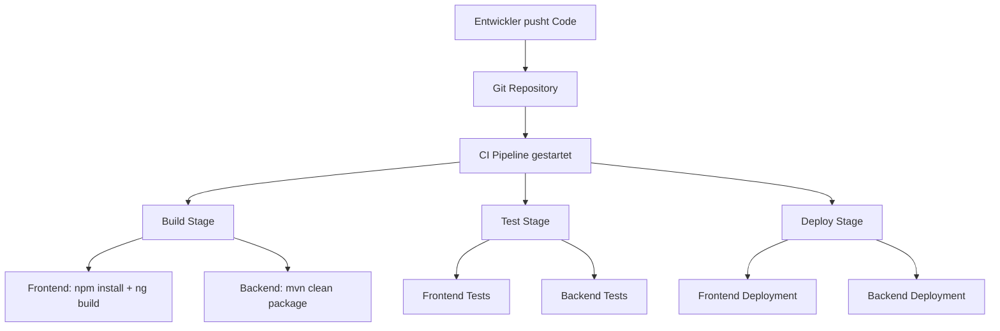

# FitMatch

FitMatch ist eine Plattform zur einfachen Vermittlung von Trainingspartnern auf Basis von Sportart, Standort und Leistungsniveau.  
Nutzer können ein Profil erstellen und passende Personen in ihrer Nähe finden, um gemeinsam zu trainieren.  
Ziel ist es, den Einstieg in regelmäßigen Sport durch soziale Motivation zu erleichtern.

## Git-Strategie

### Branches:
- main → stabile, getestete Versionen
- develop → aktueller Entwicklungsstand
- feature/* → neue Funktionen
- bugfix/* → Fehlerbehebungen

**Begründung:**  
Für das Projekt wird eine vereinfachte Git-Flow-Strategie verwendet.  
Die Strategie bietet eine klare Trennung zwischen stabiler Version und Entwicklung, bleibt dabei aber bewusst einfach.  
Sie eignet sich gut für ein kleines Team und ein MVP, da paralleles Arbeiten möglich ist und jederzeit eine lauffähige Version bereitsteht.

**Alternativen:**  
- Klassischer Git-Flow → zu komplex  
- GitHub Flow → keine klare Trennung von stabil/Entwicklung  
- Trunk-Based Development → riskanter ohne starke Tests

**Branch-Namenskonvention**  
<branch-typ>/<kurze-beschreibung>

**Beispiele:**  
- feature/matching-basic  
- feature/user-profile  
- bugfix/login-error

**Regeln:**  
- Kleinbuchstaben
- Bindestriche statt Leerzeichen
- kurze, klare Namen

**Merge-Regeln & Review-Prozess**  
- Keine direkten Commits auf main oder develop  
- Änderungen nur über Pull Requests  
- Merge von feature/* → develop  
- Merge von develop → main für Releases  

**Review-Prozess:**
- mindestens 1 Review vor Merge
- Prüfung auf Funktionalität und Codequalität
- optional: erfolgreiche Tests erforderlich

## CI/CD-Ablauf:

