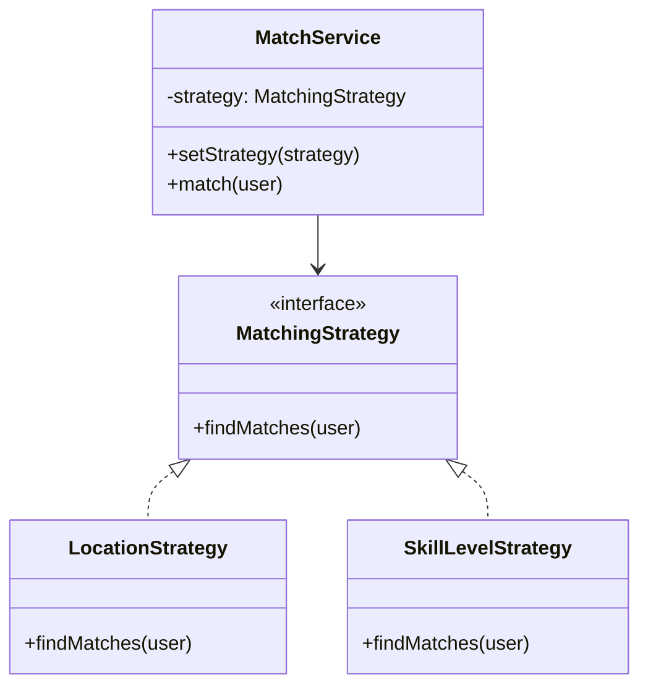
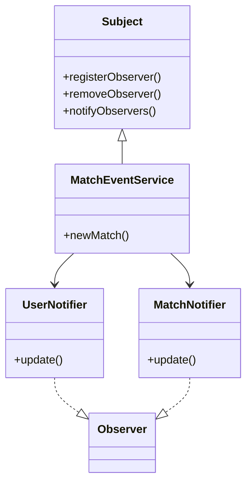

# Design Patterns für FitMatch

## 1. Projektkontext

FitMatch ist eine Plattform zur Vermittlung von Trainingspartnern auf Basis von Sportart, Standort und Leistungsniveau.

Mögliche Erweiterungen:

* weitere Sportarten
* Chat-Funktion
* Gruppen-Trainings
* Benachrichtigungen

---

# 2. Auswahl von zwei GoF-Design-Patterns

## 2.1: Strategy Pattern

### Einsatz im Projekt

Das Matching von Trainingspartnern kann auf unterschiedliche Weise erfolgen:

* nach Standort
* nach Sportart
* nach Leistungsniveau
* nach gemeinsamen Interessen

Das Strategy Pattern erlaubt es, verschiedene Matching-Algorithmen flexibel auszutauschen.

### Begründung

* flexibel erweiterbar
* lose Kopplung zwischen Matching-Service und Algorithmus
* neue Matching-Strategien können ohne Änderung bestehender Klassen ergänzt werden

---

## 2.2: Observer Pattern

### Einsatz im Projekt

Nutzer sollen Benachrichtigungen erhalten, wenn:

* ein neuer passender Trainingspartner verfügbar ist
* eine Trainingsanfrage angenommen wurde
* ein Nutzer online ist

Das Observer Pattern ermöglicht automatische Benachrichtigungen an mehrere Nutzer.

### Begründung

* gute Entkopplung zwischen Ereignis und Benachrichtigung
* leicht erweiterbar
* mehrere Observer möglich

---

## 3 Klassendiagramme

### 3.1 – Strategy Pattern



---

### 3.2 – Observer Pattern



---

## 4. Code-Skizzen

## 4.1 – Strategy Pattern (Java / Quarkus)

```java
interface MatchingStrategy {
    List<String> findMatches(String user);
}

class LocationStrategy implements MatchingStrategy {
    public List<String> findMatches(String user) {
        return List.of("Max", "Anna");
    }
}

class SkillLevelStrategy implements MatchingStrategy {
    public List<String> findMatches(String user) {
        return List.of("Tom", "Lisa");
    }
}

class MatchService {

    private MatchingStrategy strategy;

    public void setStrategy(MatchingStrategy strategy) {
        this.strategy = strategy;
    }

    public List<String> match(String user) {
        return strategy.findMatches(user);
    }
}
```

---

### 4.2 – Observer Pattern (Java / Quarkus)

```java
interface Observer {
    void update(String message);
}

class UserObserver implements Observer {
    public void update(String message) {
        System.out.println("Benachrichtigung: " + message);
    }
}

class MatchEventService {

    private List<Observer> observers = new ArrayList<>();

    public void addObserver(Observer observer) {
        observers.add(observer);
    }

    public void notifyObservers(String message) {
        for (Observer observer : observers) {
            observer.update(message);
        }
    }
}
```

---

# 5. Stand-up / Sprint-Aufteilung

| Teammitglied | Aufgabe                                  |
| ------------ | -------------------------------------    |
| Person A     | Strategy Pattern + Matching-Service      |
| Person B     | Observer Pattern + Benachrichtigungen    |
| Person A     | Mermaid-Diagramme - Strategy Pattern     |
| Person B     | Mermaid-Diagramme - Observer Pattern     |
| Person A     | Tests & Dokumentation - Strategy Pattern |
| Person B     | Tests & Dokumentation - Observer Pattern |
| Person A     | Review - Strategy Pattern                |
| Person B     | Review - Observer Pattern                |

---